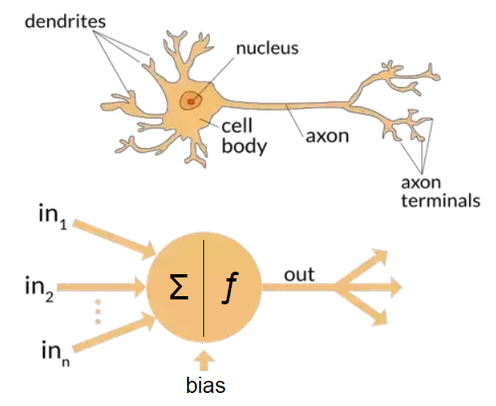
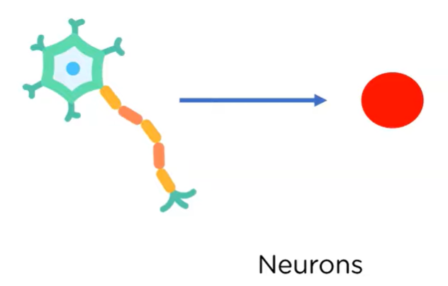
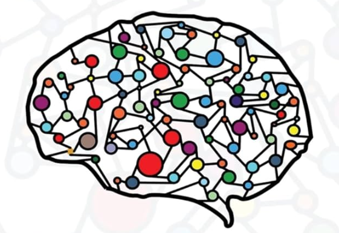
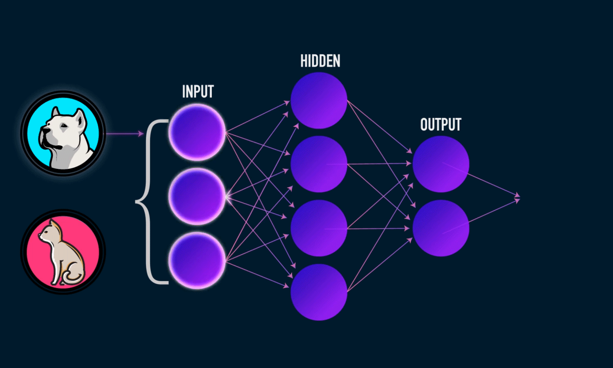
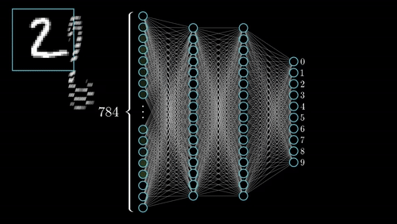
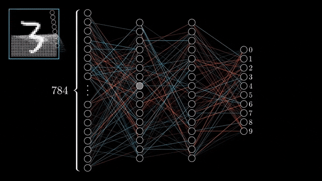
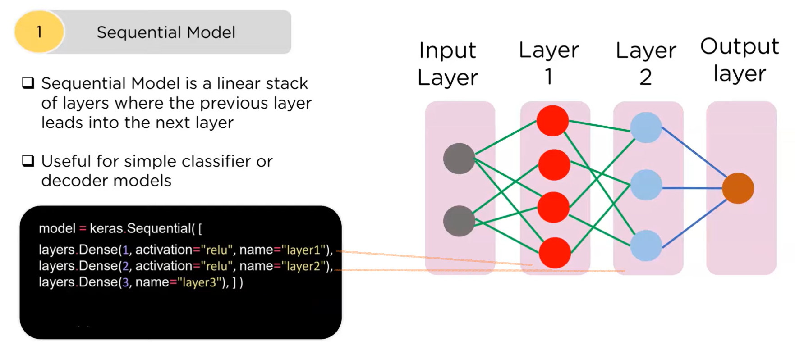

# Keras et Deep Learning

## Réseau de neurones

### Neurone et Neurone Artificiel :

Un neurone est comme un petit messager dans votre cerveau. C'est une cellule spéciale qui aide votre cerveau à communiquer avec le reste de votre corps. Un neurone artificiel est comme une version informatique d'un vrai neurone. Il est conçu pour faire des choses similaires mais à l'intérieur d'un ordinateur. Voici une explication simple :



**Parties d'un neurone** :
   - **Corps cellulaire (Calcul)** : C'est comme le centre de contrôle principal du neurone. Il contient toutes les choses importantes.
   - **Dendrites (Entrée)** : Pensez à cela comme les bras du neurone. Ils atteignent d'autres neurones pour récupérer des informations.
   - **Axone (Sortie)** : C'est comme la queue du neurone. Il envoie des messages à d'autres neurones ou parties du corps.

Pour simplifier, nous représentons un neurone sous forme de cercle. Les entrées sont représentées par des connexions sur le côté gauche du cercle, tandis que les sorties sont représentées par des lignes sur le côté droit.


### Réseau de neurones

Vos cerveaux sont composés de réseaux de neurones. C'est l'idée d'un réseau de neurones artificiels. Nous configurons des neurones artificiels pour construire quelque chose comme un cerveau.



Le cerveau est si complexe, donc pour simplifier, nous l'organisons en couches indépendantes. Chaque couche a un rôle différent :


- **[Couche d'entrée]** : Cette couche prend des données, comme des pixels d'une image ou des mots d'une phrase.
- **[Couches cachées]** : Ces couches traitent les données de différentes manières, trouvant des motifs ou des caractéristiques.
- **[Couche de sortie]** : Cette couche nous donne le résultat final, comme identifier ce qui est dans l'image ou comprendre le sens de la phrase.




Dans cet exemple, nous avons une couche d'entrée avec 3 neurones, une couche cachée avec 4 neurones, et enfin la couche de sortie avec 2 neurones.


### Deep Learning

Le deep learning est un type puissant d'apprentissage automatique basé sur des réseaux de neurones artificiels. Il est appelé "profond" car il utilise de nombreuses couches de neurones artificiels pour apprendre et prendre des décisions.




### Fonction de Perte
La fonction de perte est une mesure de l'erreur entre les prédictions d'un modèle et les vraies valeurs attendues. En d'autres termes, c'est une façon de quantifier à quel point les prédictions du modèle sont proches ou éloignées de ce qu'elles devraient être. 




# Keras

Keras est une bibliothèque conviviale d'apprentissage profond qui simplifie le processus de construction, d'entraînement et de déploiement de modèles de réseaux de neurones profonds. Explorons un exemple de création d'un modèle séquentiel en utilisant Keras.

## Création d'un modèle séquentiel



### Importation des bibliothèques nécessaires

Tout d'abord, nous devons importer les bibliothèques requises de Keras, notamment `Sequential` pour créer le modèle et `Dense` pour ajouter des couches au modèle.

```python
from keras.models import Sequential
from keras.layers import Dense
```

### Création d'un modèle séquentiel

Nous créons un modèle séquentiel, qui est une pile linéaire de couches. Cette approche nous permet d'ajouter des couches une par une, en construisant progressivement le réseau de neurones.

```python
model = Sequential()
```

### Ajout de couches au modèle

Pour définir l'architecture de notre modèle d'apprentissage profond, nous devons ajouter des couches. Cela peut être fait en utilisant la méthode `add()`. Dans cet exemple, nous ajoutons une couche Dense avec 64 unités et une fonction d'activation ReLU comme première couche. La forme d'entrée est spécifiée comme (100,), indiquant que chaque échantillon d'entrée a 100 caractéristiques. Ensuite, nous ajoutons une autre couche Dense avec 10 unités et une fonction d'activation softmax comme couche de sortie.

```python
model.add(Dense(units=64, activation='relu', input_shape=(100,)))
model.add(Dense(units=10, activation='softmax'))
```

Alternativement, nous pouvons créer le modèle séquentiel et ajouter des couches simultanément en passant un tableau contenant les configurations des couches.

```python
model = Sequential([
   Dense(units=64, activation='relu', input_shape=(100,)),
   Dense(units=10, activation='softmax')
])
```

### Compilation du modèle

Une fois l'architecture du modèle définie, nous devons compiler le modèle. Cela implique de spécifier l'optimiseur, la fonction de perte et la métrique d'évaluation. Dans cet exemple, nous compilons le modèle en utilisant l'optimiseur Adam et l'entropie croisée catégorielle comme fonction de perte. De plus, nous spécifions 'accuracy' comme métrique pour évaluer les performances du modèle.

```python
model.compile(optimizer='adam', loss='categorical_crossentropy', metrics=['accuracy'])
```

### Affichage du résumé du modèle

Enfin, nous affichons le résumé du modèle en utilisant la méthode `summary()`. Cela fournit des informations complètes sur l'architecture du modèle, y compris le type de couches, la forme de sortie et le nombre de paramètres.


```python
model.summary()
```

### Entraînement du modèle
Nous pouvons utiliser la fonction `fit` pour entraîner notre modèle en utilisant l'ensemble de données d'entraînement. Une époque fait référence à une itération complète à travers l'ensemble de données d'entraînement.

```
model.fit(X_train, y_train, epochs=10)
```
Avoir plus d'époques permet au modèle de mieux apprendre vos données, mais cela peut entraîner un surajustement. Le surajustement se produit lorsque le modèle apprend trop des données d'entraînement et ne peut pas généraliser correctement aux données non vues (données de test).


### Évaluation du modèle

```
loss, accuracy = model.evaluate(X_test, y_test)
print(f"Loss: {loss}, Accuracy: {accuracy}")

```


## GPU vs CPU pour Deep Learning

Si nous examinons la conception d'un réseau de neurones, nous remarquons un schéma récurrent : la même opération (calcul du neurone) est appliquée à un grand ensemble de données. Ce calcul du neurone est généralement exprimé comme une opération mathématique : sortie = f(entrée * poids + biais). Cette opération reste constante pour tous les neurones, seuls les données (entrées, poids et biais) variant.

Face à ce schéma, il devient évident qu'un processeur central traditionnel, qui traite individuellement chaque donnée séquentiellement, peut ne pas offrir la solution la plus efficace. À la place, une architecture matérielle spécialisée, optimisée pour l'exécution de la même série d'opérations en virgule flottante sur un ensemble de données, peut considérablement améliorer les performances tout en réduisant les coûts.

Cette prise de conscience a donné naissance à l'Unité de Traitement Graphique (GPU), un matériel spécialisé conçu pour exécuter la même opération sur plusieurs éléments de données simultanément. Les GPU exploitent les capacités de traitement parallèle pour gérer efficacement de grands ensembles de données, les rendant particulièrement adaptés à des tâches telles que le traitement d'images et de vidéos, les simulations scientifiques et l'apprentissage automatique.

En revanche, les Unités Centrales de Traitement (CPU) sont conçues pour l'exécution séquentielle d'instructions, compétentes pour gérer diverses tâches avec flexibilité. Bien que les CPU excellent dans la polyvalence, ils sont comparativement moins efficaces dans le traitement parallèle de la même opération par rapport aux GPU.

Pour mieux comprendre les différences entre GPU et CPU je vous propose de voir cette étonnante vidéo
[](https://www.youtube.com/watch?v=-P28LKWTzrI "")


### Exemple Réel
<a target="_blank" href="https://colab.research.google.com/github/modaresimr/AdvancedPython/blob/main/C3/example1.ipynb">
  
</a>


# Excercice 1 (Warm UP)
<a target="_blank" href="https://colab.research.google.com/github/modaresimr/AdvancedPython/blob/main/C3/e3.ipynb">
  
</a>

# Exercice 2

Utilisez l'ensemble de données que vous avez sélectionné il y a deux semaines. Nous souhaitons poursuivre sur le notebook que nous avons créé la semaine dernière. Utilisez un modèle d'apprentissage profond en utilisant Keras et faites des prédictions. Comparez les résultats avec les autres classificateurs.

À la fin, vous devez soumettre le notebook de l'exercice 2 via [ce lien](https://forms.gle/Ba9yZdxayHvG7Eai9).


