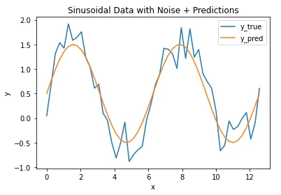
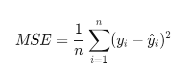

# Apprentissage profond (Deep learning) : Régression

La régression en apprentissage profond consiste à prédire une valeur continue en sortie plutôt qu'une étiquette catégorique. Elle est couramment utilisée dans des scénarios tels que la prédiction des prix des maisons, des prix des actions ou des prévisions de ventes.

Voici un petit exemple pour illustrer la régression en apprentissage profond :

Supposons que nous voulions construire un modèle pour prédire le prix d'une maison en fonction de sa taille en pieds carrés. Nous disposons d'un ensemble de données contenant des paires de tailles de maison et de leurs prix correspondants.

| Taille de la maison (pieds carrés) | Prix ($) |
|------------------------------------|----------|
|              1000                  |   300000 |
|              1500                  |   400000 |
|              2000                  |   500000 |
|              2500                  |   600000 |
|              3000                  |   700000 |

Nous pouvons utiliser l'apprentissage profond pour entraîner un modèle de régression sur cet ensemble de données. Voici comment procéder :

1. **Préparation des données** : Prétraiter l'ensemble de données, normaliser les caractéristiques si nécessaire, et le diviser en ensembles d'entraînement et de test.

2. **Architecture du modèle** : Concevoir une architecture de réseau neuronal adaptée à la régression. Pour simplifier, nous pouvons commencer avec une architecture de base composée d'une couche d'entrée et d'une couche de sortie. Comme nous avons une seule caractéristique d'entrée (la taille de la maison), la couche d'entrée aura un neurone. La couche de sortie aura également un neurone, prédisant le prix de la maison.

3. **Entraînement** : Entraîner le modèle sur les données d'entraînement en utilisant une fonction de perte appropriée pour les tâches de régression, telle que l'erreur quadratique moyenne (MSE). Utiliser des techniques d'optimisation comme la descente de gradient stochastique (SGD) ou Adam pour minimiser la perte et mettre à jour les poids du modèle.

4. **Évaluation** : Évaluer le modèle entraîné sur les données de test pour évaluer ses performances. Des métriques telles que l'erreur absolue moyenne (MAE) ou l'erreur quadratique moyenne (RMSE) peuvent être utilisées pour mesurer la précision du modèle dans la prédiction des prix des maisons.

5. **Prédiction** : Une fois que le modèle est entraîné et évalué, il peut être utilisé pour faire des prédictions sur de nouvelles tailles de maison non vues auparavant. Étant donné la taille d'une maison, le modèle produira un prix prédit en fonction de ses modèles appris à partir des données d'entraînement.

La régression en apprentissage profond implique d'entraîner un réseau neuronal à prédire des valeurs continues (par exemple, les prix des maisons) en fonction de caractéristiques d'entrée (par exemple, la taille de la maison), et elle suit un flux de travail similaire aux tâches de classification mais avec des architectures de modèle et des fonctions de perte différentes.

## RNN (Réseau de Neurones Récurrents)
Un Réseau de Neurones Récurrents (RNN) est un type de réseau neuronal artificiel conçu pour traiter efficacement des données séquentielles en conservant et en utilisant des informations des étapes précédentes. Contrairement aux réseaux de neurones à propagation avant, qui traitent les données d'entrée indépendamment, les RNN maintiennent un état interne (état caché) qui capture des informations sur les entrées précédentes dans la séquence.

Un exemple de l'utilisation d'un réseau de neurones récurrents (RNN) consiste à prédire la météo pour demain en fonction des données météorologiques historiques, puis à utiliser la météo prédite pour demain comme entrée pour prédire la météo pour le lendemain.

### LSTM
La mémoire à court et long terme (LSTM) est un type d'architecture de réseau de neurones récurrents (RNN), spécifiquement conçue pour surmonter les limitations des RNN traditionnels dans la capture et l'apprentissage des dépendances à long terme dans les données séquentielles. Les LSTM sont particulièrement efficaces dans les tâches impliquant des données de séries chronologiques, le traitement du langage naturel et d'autres analyses de

# Erreur quadratique moyenne (Mean Square Error)

Supposons que vous disposiez de prédictions continues et de valeurs réelles, comme illustré dans l'image ci-dessous.

Comment pouvons-nous évaluer la qualité de la prédiction ?

Dans ce cas, nous ne pouvons pas utiliser les concepts de Vrai Positif (TP), Faux Positif (FP), Faux Négatif (FN) ou Vrai Négatif (TN) car il y a toujours une erreur entre la prédiction et les valeurs réelles. Par conséquent, nous devons calculer la distance entre la prédiction et la valeur réelle.

L'erreur quadratique moyenne (MSE) est une mesure couramment utilisée dans les tâches de régression pour évaluer la performance d'un modèle. Elle mesure la moyenne des carrés des différences entre les valeurs réelles et les valeurs prédites. Mathématiquement, elle est calculée comme suit :

Où :
- `n` est le nombre total d'échantillons.
- `y_i` est la valeur réelle de la variable cible pour le i-ème échantillon.
- `ŷ_i` est la valeur prédite de la variable cible pour le i-ème échantillon.

L'erreur quadratique moyenne pénalise davantage les grandes erreurs en raison de l'opération de mise au carré, ce qui la rend sensible aux valeurs aberrantes. Une valeur de MSE plus faible indique que les prédictions du modèle sont plus proches des valeurs réelles, ce qui implique de meilleures performances.

L'erreur quadratique moyenne est souvent utilisée comme fonction de perte lors du processus d'entraînement en apprentissage profond. L'objectif est de minimiser l'erreur quadratique moyenne en ajustant les paramètres du modèle (poids et biais) à l'aide d'algorithmes d'optimisation tels que Adam.

