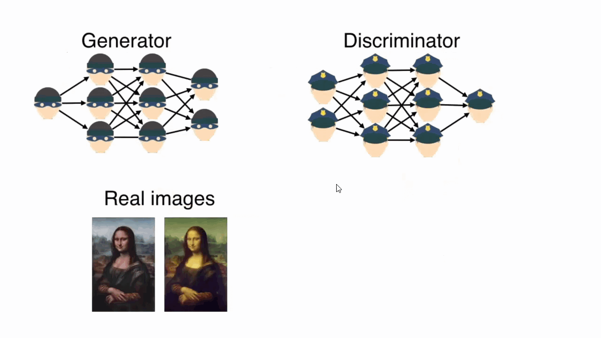

# Sujet Avancé : GAN (Réseau Génératif Antagoniste)
[source](https://developers.google.com/machine-learning/gan/gan_structure)

Avez-vous déjà visité ce site https://thispersondoesnotexist.com/ ?
Il peut générer une personne qui n'existe pas du tout et qui est totalement générée par des réseaux profonds ! WoW !

GAN signifie Generative Adversarial Network (Réseau Génératif Antagoniste).
Les GAN sont une innovation récente passionnante en matière d'apprentissage automatique. Les GAN sont des modèles génératifs : ils créent de nouvelles instances de données qui ressemblent à vos données d'entraînement. Par exemple, les GAN peuvent créer des images qui ressemblent à des photographies de visages humains, même si les visages n'appartiennent à aucune personne réelle. Ces images ont été créées par un GAN :

> Figure 1 : Images générées par un GAN créé par NVIDIA.

Les GAN parviennent à ce niveau de réalisme en associant un générateur, qui apprend à produire la sortie cible, avec un discriminateur, qui apprend à distinguer les données réelles de la sortie du générateur. Le générateur essaie de tromper le discriminateur, et le discriminateur essaie de ne pas être trompé.

Les GAN sont une classe de systèmes d'apprentissage automatique conçus pour générer de nouveaux contenus, généralement des images, de la musique, de la parole ou du texte, similaires à certains données d'entrée.

L'idée principale derrière les GAN est d'avoir deux réseaux neuronaux, un **générateur** et un **discriminateur**, qui s'affrontent dans un cadre de théorie des jeux. Le générateur essaie de produire des échantillons de données réalistes à partir de bruit aléatoire, tandis que le discriminateur essaie de distinguer entre des échantillons de données réelles et ceux générés par le générateur. Grâce à ce processus antagoniste, les deux réseaux s'améliorent au fil du temps, le générateur devenant meilleur pour créer des échantillons réalistes et le discriminateur devenant meilleur pour distinguer le vrai du faux.

Un réseau génératif antagoniste (GAN) se compose de deux parties :

- Le **générateur** apprend à générer des données plausibles. Les instances générées deviennent des exemples d'entraînement négatifs pour le discriminateur.
- Le **discriminateur** apprend à distinguer les données factices du générateur des données réelles. Le discriminateur pénalise le générateur pour la production de résultats implausibles.

Lorsque l'entraînement commence, le générateur produit des données clairement factices, et le discriminateur apprend rapidement à le détecter :

> Trois colonnes sont étiquetées 'Données Générées', 'Discriminateur' et
          'Données Réelles'. Sous 'Données Générées', un rectangle bleu contient
          un gribouillis et un cercle. Le rectangle représente la première tentative
          maladroite du générateur
          pour dessiner un billet de dollar. Sous 'Données Réelles', il y a une image d'un véritable
          billet de dix dollars. Sous 'Discriminateur', les mots 'FAUX' et
          'RÉEL' sont affichés. Une flèche pointe depuis le mot 'FAUX' vers l'image sous
          'Données Générées'. Une autre flèche pointe depuis le mot 'RÉEL' vers l'image sous
          'Données Réelles'.
Au fur et à mesure de l'entraînement, le générateur se rapproche de la production de résultats capables de tromper le discriminateur :

> Cette image ajoute une nouvelle ligne sous les en-têtes 'Données Générées', 'Discriminateur' et
          'Données Réelles' de l'image précédente. Sous 'Données Générées',
          il y a un rectangle vert avec le numéro 10 dans le coin supérieur gauche
          et un dessin simple d'un visage. Sous 'Données Réelles', il y a une image de
          un véritable billet de 100 dollars. Sous 'Discriminateur', le mot 'FAUX' est affiché
          avec une flèche pointant vers l'image sous 'Données Générées' et le mot
          'RÉEL' avec une flèche pointant vers l'image sous 'Données Réelles'.
          
Enfin, si l'entraînement du générateur se déroule bien, le discriminateur a de plus en plus de mal à distinguer le vrai du faux. Il commence à classer les données factices comme réelles, et son exactitude diminue :

> Cette image ajoute une nouvelle ligne sous les en-têtes 'Données Générées', 'Discriminateur' et
          'Données Réelles' de la première image précédente. Sous 'Données Générées',
          il y a une image d'un billet de vingt dollars. Sous 'Données Réelles',
          il y a une image d'un billet de vingt dollars. Sous 'Discriminateur',
          le mot 'RÉEL' est affiché avec une flèche pointant vers l'image sous 'Données Générées' et le mot
          'RÉEL' avec une flèche pointant vers l'image sous 'Données Réelles'.
Voici une image du système complet :

> Un diagramme d'un réseau génératif antagoniste. Au centre du
          diagramme se trouve une boîte étiquetée 'discriminateur'. Deux branches alimentent cette
          boîte depuis la gauche. La branche supérieure commence en haut à gauche du
          diagramme avec un cylindre étiqueté 'images du monde réel'. Une flèche mène
          de ce cylindre à une boîte étiquetée 'Échantillon'. Une flèche part de la boîte
          étiquetée 'Échantillon' vers la boîte 'Discriminateur'. La branche inférieure
          alimente la boîte 'Discriminateur' à partir d'une boîte étiquetée 'Entrée Aléatoire'. Une flèche part de la boîte 'Entrée Aléatoire' vers une boîte étiquetée
          'Générateur'. Une flèche part de la boîte 'Générateur' vers une deuxième
          boîte 'Échantillon'. Une flèche part de la boîte 'Échantillon' vers la
          boîte 'Discriminateur'. Sur le côté droit de la boîte Discriminateur, une
          flèche mène à une boîte contenant un cercle vert et un cercle rouge. Le
          mot 'RÉEL' apparaît en texte vert au-dessus de la boîte et le mot 'FAUX'
          apparaît en rouge en dessous de la boîte. Deux flèches partent de cette boîte
          vers deux boîtes sur le côté droit du diagramme. Une flèche mène à une boîte
          étiquetée 'Perte du Discriminateur'. L'autre flèche mène à une boîte étiquetée
          'Perte du Générateur'.

Tant le générateur que le discriminateur sont des réseaux neuronaux. La sortie du générateur est directement connectée à l'entrée du discriminateur. Par rétropropagation, la classification du discriminateur fournit un signal que le générateur utilise pour mettre à jour ses poids.

Expliquons en détail les composants de ce système.

**Discriminateur** :
Vous vous souvenez comment nous avons créé un système d'apprentissage automatique capable de classer les vêtements ?
ou vous vous souvenez de notre exemple de modèle qui distingue la banane de la pomme ?

Le discriminateur est exactement la même chose. Cependant, les données d'entraînement sont des images réelles et des images factices générées par le générateur.

Les données d'entraînement du discriminateur proviennent de deux sources :

- Des instances de données réelles, telles que de vraies photos de personnes. Le discriminateur utilise ces instances comme exemples positifs pendant l'entraînement.
- Des instances de données factices créées par le générateur. Le discriminateur utilise ces instances comme exemples négatifs pendant l'entraînement.

Et le discriminateur devrait identifier correctement si l'entrée est fausse ou réelle.

**Générateur** :
La partie générateur d'un GAN apprend à créer des données factices en intégrant les retours du discriminateur. Comment ? Le générateur devrait être capable de tromper le discriminateur. Si le générateur peut tromper le discriminateur, cela signifie qu'il peut générer de bons exemples et il remporte la partie.

D'autre part, le discriminateur veut gagner en ne se laissant pas tromper par le générateur. Donc, tous les deux essayent d'améliorer leur modèle ! Génial ! Allons plus loin.

Nous alimentons une entrée aléatoire au Générateur, le générateur essaie de convertir cette entrée aléatoire en un exemple. Si l'exemple généré peut tromper le discriminateur, il reçoit des retours positifs indiquant qu'il a bien fait son travail. Sinon, il recevra des retours négatifs (pénalités) liés à la probabilité de sa fausseté.

**Entrée Aléatoire** :
Les réseaux neuronaux ont besoin d'une forme d'entrée. Normalement, nous fournissons des données que nous voulons utiliser, comme une instance d'image que nous voulons classifier ou sur laquelle nous voulons faire une prédiction. Mais que devons-nous utiliser comme entrée pour un réseau qui produit entièrement de nouvelles instances de données ?

Dans sa forme la plus basique, un GAN prend des valeurs aléatoires comme entrée. Le générateur apprend ensuite à transformer ces valeurs aléatoatoires en une sortie significative. En introduisant des valeurs aléatoires, nous pouvons amener le GAN à produire une grande variété de données, en échantillonnant à partir de différents endroits dans la distribution cible.

**Entraînement d'un GAN** :

Nous avons compris qu'un GAN se compose de deux modèles profonds séparés : le générateur et le discriminateur. Nous devons entraîner les deux modèles, mais nous les entraînons individuellement.

**Étape 1 : Entraînement du discriminateur** :

Demandez au générateur de générer un ensemble d'instances aléatoires en tant qu'instances négatives. Puis combinez-les avec des instances réelles en tant qu'instances positives, et entraînez le discriminateur avec ces données pendant un ou plusieurs epochs. Le discriminateur apprend à identifier uniquement les instances réelles comme positives et le reste comme négatives.

**Étape 2 : Entraînement du Générateur** :

Maintenant, nous essayons de former le Générateur pendant un ou plusieurs epochs en minimisant le risque de détection en tant qu'exemple faux.

**Étape 3 : Répétez les Étapes 1 et 2 jusqu'à la fin de l'entraînement**.

Dans la première étape, le générateur n'est pas entraîné, donc il génère des valeurs totalement aléatoires. Le discriminateur peut facilement être entraîné à le distinguer. Après avoir répété cela plusieurs fois, le générateur apprend à tromper le discriminateur.

Le générateur apprend à produire des données réalistes en se basant sur les retours du discriminateur, tandis que le discriminateur apprend à mieux distinguer les données réelles des données générées. Ce processus itératif continue jusqu'à ce que le générateur produise des données de haute qualité qui sont indiscernables des données réelles.

En résumé, les GAN sont une technique puissante pour générer des données réalistes dans divers domaines tels que la génération d'images, de musique, de texte, etc. en utilisant un processus d'entraînement adversatif entre un générateur et un discriminateur.

# Example 1 

# Exercice  1 

# Exercice 2 (Supplémentaire)

Pour trouver une collection d'images sur Internet, vous pouvez rechercher des ensembles de données ouverts disponibles sur des plateformes telles que Kaggle, le Répertoire de l'apprentissage automatique de l'UCI ou les sites Web des institutions de recherche. Voici les étapes à suivre :

1. Accédez à un site Web ou à une plateforme proposant des ensembles de données ouverts.
2. Recherchez des ensembles de données de classification d'images.
3. Sélectionnez un ensemble de données contenant des images sans étiquettes (ou supprimez les étiquettes si elles sont incluses).
4. Téléchargez l'ensemble de données.
5. Prétraitez les images en les redimensionnant en 28x28 pixels.

Comme nous ne disposons pas de suffisamment de matériel, vous devrez redimensionner les images en 28x28 pixels. Si cela fonctionne, vous pourrez ensuite les redimensionner à une résolution supérieure (Demandez à ChatGPT comment redimensionner les images).

Après le prétraitement, vous pouvez utiliser les images redimensionnées comme entrée pour générer de nouvelles images à l'aide des GAN. Si les images redimensionnées fonctionnent bien, vous pouvez essayer de les redimensionner à nouveau pour voir si vous pouvez générer des images de résolution plus élevée. Gardez à l'esprit que la qualité des images générées peut varier en fonction de l'ensemble de données et de la complexité des images.
